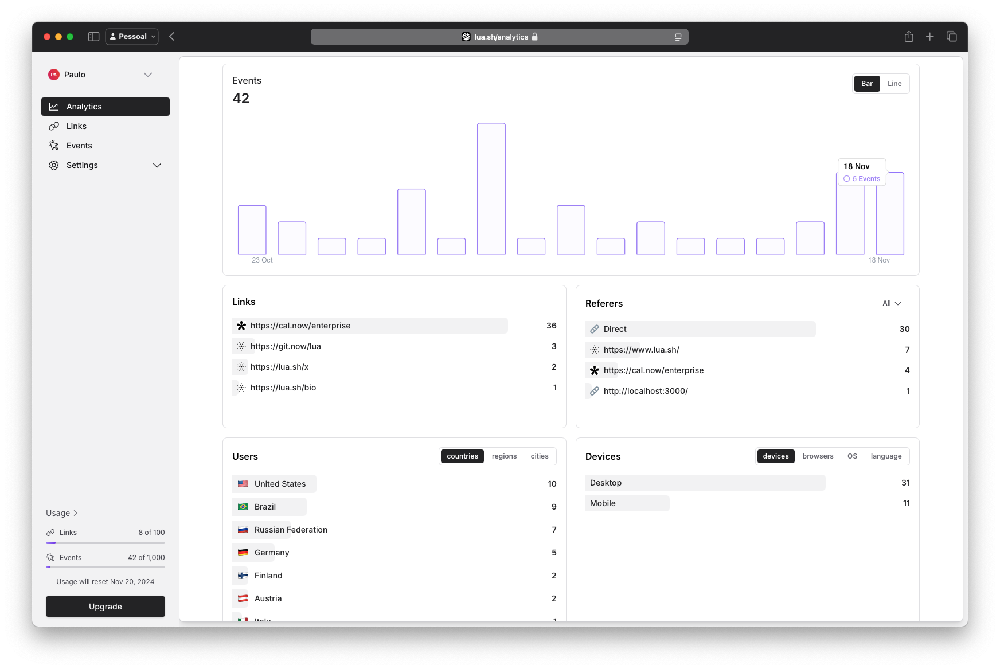
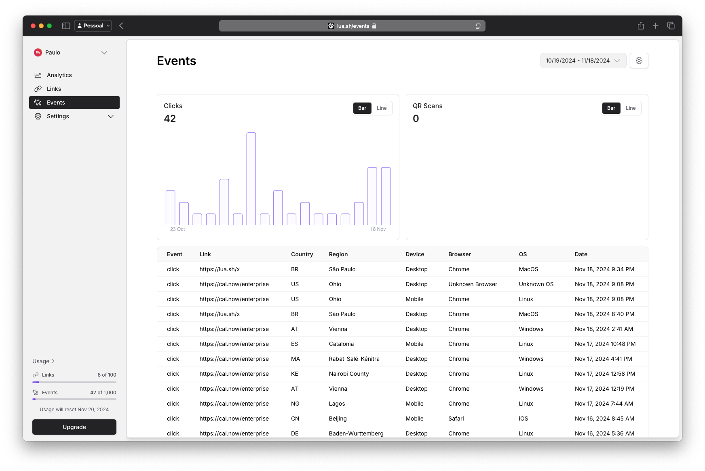
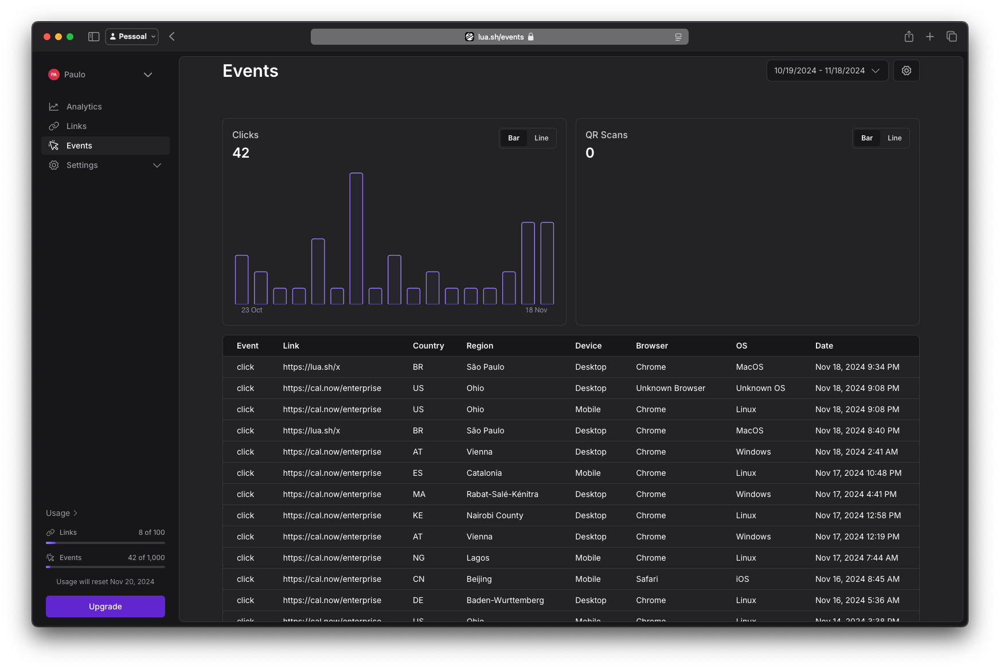

# lua.sh - Scalable & Open-Source URL Shortener

**lua.sh** is a next-generation, scalable, and open-source URL shortener built with the modern stack of Laravel, Vue 3, and Inertia.js. Designed to be fast, flexible, and developer-friendly, **lua.sh** empowers you to create and manage your own professional URL shortening service with ease.

Whether you're an individual looking for branded, trackable links or a business aiming to scale with advanced analytics and custom domains, **lua.sh** is your perfect solution. It’s lightweight, fully customizable, and ready to grow with your needs.

## 🌟 Features

- 🌐 **Shorten URLs**: Quickly shorten long URLs with an intuitive interface.
- 📊 **Detailed Analytics**: Track clicks, referers, devices, geolocation, and more with a comprehensive dashboard.
- ⚡ **Custom Domains**: Add and manage custom domains to create branded URLs.
- 🔗 **Custom URL Slugs**: Personalize your links with memorable, custom slugs.
- 📱 **Responsive Design**: Enjoy a mobile-friendly front end built with Vue 3 and TailwindCSS.
- 🔒 **Authentication & Authorization**: Protect the service with secure authentication and manage permissions for team-based usage.
- 💡 **Link Expiration & Management**: Set expiration dates for links and manage them effortlessly.
- 🔐 **Secure by Design**: Includes built-in CSRF protection, rate-limiting, and HTTPS support.

---

## 🛠️ Tech Stack

### **Backend**
- [Laravel](https://laravel.com/): A robust PHP framework designed for high-performance, scalable applications.
- [MySQL](https://www.mysql.com/): Reliable relational database for storing and managing data.

### **Frontend**
- [Vue 3](https://vuejs.org/): A progressive, reactive JavaScript framework for creating modern interfaces.
- [Inertia.js](https://inertiajs.com/): Seamlessly integrates server-side rendering with single-page app features.
- [TailwindCSS](https://tailwindcss.com/): Utility-first CSS framework for designing clean and responsive UIs.

### **Middleware**
- [Inertia.js](https://inertiajs.com/): Combines Laravel and Vue into a smooth SPA-like experience.

---
### Images

**Dark Mode is also available**

## 🌟 Premium Domains - Cloud Only
**lua.sh** provide you access to an array of sleek and memorable domains for your shortened URLs:

- 🔗 **lua.sh**: The default, clean, and professional option.
- 🔗 **git.now**: Perfect for developers and teams sharing repositories.
- 🔗 **cal.now**: Ideal for sharing meeting links or scheduling tools.
- 🔗 **fig.now**: A unique and versatile option for creatives.
- 🔗 **spoti.now**: Great for sharing music playlists and podcasts.

For self-hosting or local development, please check the [Self Hosting](https://developers.lua.sh/self-hosting) or [Local Development](https://developers.lua.sh/local-development) guides.

## Contributors ✨

<!-- ALL-CONTRIBUTORS-LIST:START - Do not remove or modify this section -->
<!-- prettier-ignore-start -->
<!-- markdownlint-disable -->
<table>
  <tbody>
    <tr>
      <td align="center" valign="top" width="14.28%"><a href="https://github.com/paulocastellano"> <b>Paulo Castellano</b></a> <a href="https://github.com/luadotsh/lua/commits?author=paulocastellano" title="Code">💻</a></td>
      <td align="center" valign="top" width="14.28%"><a href="https://conferencias.dev/"> <b>Victor Gazotti</b></a> <a href="https://github.com/luadotsh/lua/commits?author=Arkanius" title="Code">💻</a></td>
      <td align="center" valign="top" width="14.28%"><a href="https://muhammadsaim.com"> <b>Muhammad Saim</b></a> <a href="https://github.com/luadotsh/lua/commits?author=MuhammadSaim" title="Code">💻</a></td>
      <td align="center" valign="top" width="14.28%"><a href="https://promium.pro"> <b>Ibon Azkoitia</b></a> <a href="https://github.com/luadotsh/lua/commits?author=IbonAzkoitia" title="Code">💻</a></td>
    </tr>
  </tbody>
  <tfoot>
    <tr>
      <td align="center" size="13px" colspan="7">
        
          <a href="https://all-contributors.js.org/docs/en/bot/usage">Add your contributions</a>
        </img>
      </td>
    </tr>
  </tfoot>
</table>

<!-- markdownlint-restore -->
<!-- prettier-ignore-end -->

<!-- ALL-CONTRIBUTORS-LIST:END -->

## 💎 Sponsors
A big thanks to our sponsors and partners who make Lua possible. If you're interested in sponsoring Lua and supporting the project, please check out our profile on [GitHub sponsors](https://github.com/sponsors/luadotsh) ❤️

[mercantive.com](https://mercantive.com) • [changelogfy.com](https://changelogfy.com)
